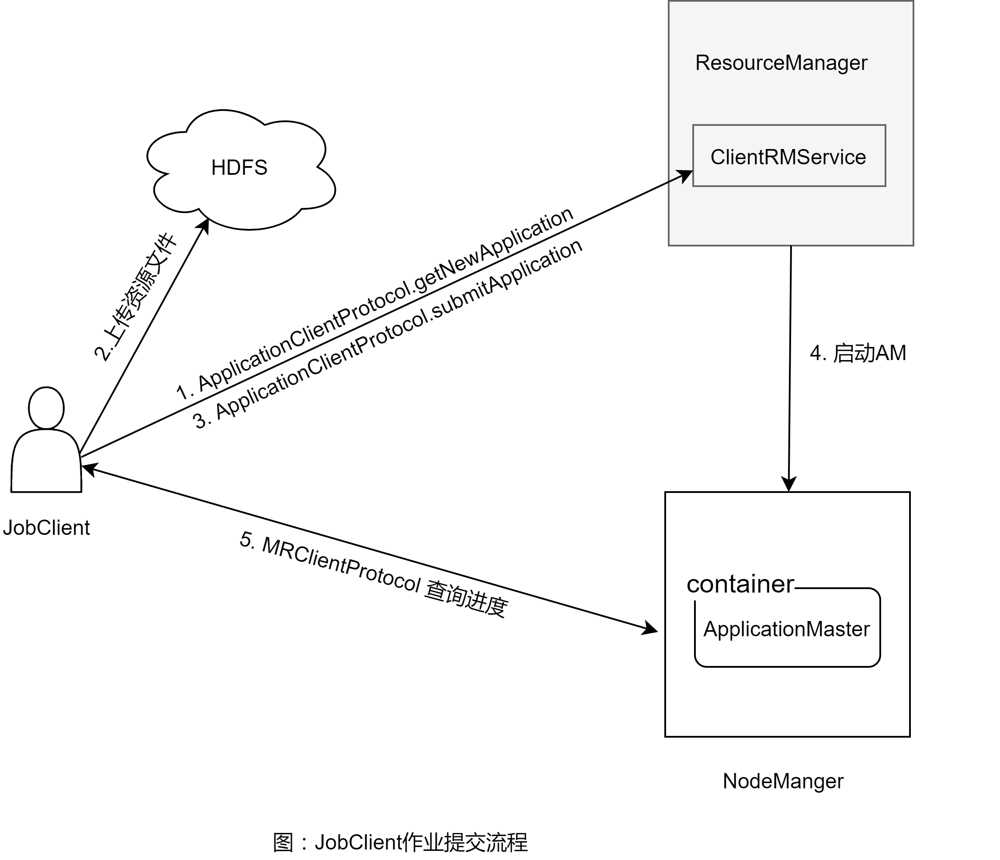

# 背景
`Hadoop 2.0`提供了[YARN](https://www.ibm.com/developerworks/cn/data/library/bd-yarn-intro/index.html)（Yet Another Resource Navigator）模块来负责集群的资源管理和分配，在此架构下，集群不再是只为`MapReduce`而生，其它类型的作业如`Spark`, `Storm`, `Scoobi`等均可以跑`YARN`上。
在最初版本的`Hadoop`中，作业提交客户端都会将作业提交给`JobTracker`, `JobTracker`统一负责资源分配回收和作业的监控，客户端不断地向`JobTracker`发送`RPC`请求来获取作业的状态和进度。
那么在`YARN`上，作业是如何被提交，运行和监控的呢？`YARN`是如何能够运行任意类型的作业的呢?本文从源码角度来分析在`YARN`下传统的`MapReduce`作业是如何被提交到集群中的。

# 作业提交解析
## 接口定义
在`YARN`中存在2大核心组件`ResourceManager`(`RM`)和`NodeManger`(`NM`)，顾名思义，`RM`用来管理节点资源，是集群的大管家，所有作业都需要向它申请资源；而`NM`用来管理单个节点，执行下达的任务,向`RM`汇报状态等。
作业通过客户端, 向`RM`提交作业，涉及到的`RPC`通信协议接口定义如下(只列举出了提交相关的接口)，
```java
public interface ApplicationClientProtocol extends ApplicationBaseProtocol {
  @Public
  @Stable
  @Idempotent
  public GetNewApplicationResponse getNewApplication(
      GetNewApplicationRequest request)
  throws YarnException, IOException;
  
  @Public
  @Stable
  @Idempotent
  public SubmitApplicationResponse submitApplication(
      SubmitApplicationRequest request) 
  throws YarnException, IOException;
  
```
在提交之前，客户端首先调用`getNewApplication()`从`RM`处获取全局唯一`ApplicationId`（格式一般为`RM`启动时间+应用计数）， 然后调用方法`submitApplication()`来提交作业，如果没有异常，则表明作业提交成功。这里我们着重关注下`SubmitApplicationRequest`类，此类只使用了`ApplicationSubmissionContext`类，`ApplicationSubmissionContext`类封装了作业描述信息，资源请求信息以及最为重要的启动`ApplicationMaster`(`AM`)的命令。在`YARN`的编程模型下，客户端需要向`RM`提供启动`AM`的命令因而`RM`才能准确地启动`AM`，而接下来`AM`需要给`NM`提供启动`Task`的命令，这些命令被封装为类`ContainerLaunchContext`，以供`NM`启动相应的`container`进程。 `ApplicationSubmissionContext`类如下:
```java
public abstract class ApplicationSubmissionContext {

  @Public
  @Stable
  public static ApplicationSubmissionContext newInstance(
      ApplicationId applicationId, String applicationName, String queue,
      Priority priority, ContainerLaunchContext amContainer,
      boolean isUnmanagedAM, boolean cancelTokensWhenComplete,
      int maxAppAttempts, Resource resource, String applicationType,
      boolean keepContainers, String appLabelExpression,
      String amContainerLabelExpression) {
     //RPC间的数据传输默认使用Protobuf，此处默认使用Protobuf实现的类
    ApplicationSubmissionContext context =
        Records.newRecord(ApplicationSubmissionContext.class);
    context.setApplicationId(applicationId);
 
    context.setApplicationName(applicationName);
    context.setQueue(queue);
    context.setPriority(priority);
    //设置启动AM的命令，环境等，NM会根据这个设置来构建启动脚本
    context.setAMContainerSpec(amContainer);
    context.setUnmanagedAM(isUnmanagedAM);
    context.setCancelTokensWhenComplete(cancelTokensWhenComplete);
    context.setMaxAppAttempts(maxAppAttempts);
    context.setApplicationType(applicationType);
    context.setKeepContainersAcrossApplicationAttempts(keepContainers);
    //根据NodeLabel来选择特殊的计算节点
    context.setNodeLabelExpression(appLabelExpression);
    context.setResource(resource);
    
   //启动AM的资源请求描述
    ResourceRequest amReq = Records.newRecord(ResourceRequest.class);
    amReq.setResourceName(ResourceRequest.ANY);
    amReq.setCapability(resource);
    amReq.setNumContainers(1);
    amReq.setRelaxLocality(true);
    amReq.setNodeLabelExpression(amContainerLabelExpression);
    context.setAMContainerResourceRequest(amReq);
    return context;
  }
  //省略其他
  }
 
```
从这个类的定义中我们可以看到客户端在提交作业时，需要设置作业队列，优先级，类型，最大尝试次数等信息，以及启动`AM`所需的资源和命令。再来看下类`ContainerLaunchContext`
```java
public abstract class ContainerLaunchContext {

  @Public
  @Stable
  public static ContainerLaunchContext newInstance(
      Map<String, LocalResource> localResources,
      Map<String, String> environment, List<String> commands,
      Map<String, ByteBuffer> serviceData,  ByteBuffer tokens,
      Map<ApplicationAccessType, String> acls) {
    ContainerLaunchContext container =
        Records.newRecord(ContainerLaunchContext.class);
    container.setLocalResources(localResources);
    container.setEnvironment(environment);
    container.setCommands(commands);
    container.setServiceData(serviceData);
    container.setTokens(tokens);
    container.setApplicationACLs(acls);
    return container;
  }
  //省略其他
  }
```
该类定义了`NM`启动`container`所需的资源，环境变量，启动命令，以及与作业权限安全相关的设置。


`ApplicationClientProtocol`接口定义了提交`Application`的规范，下面具体地分析在`MapReduce`应用中是如何利用该接口向集群提交作业的。

## 一个典型的MR作业提交代码
```java
	Configuration conf = new Configuration();
	Job job = Job.getInstance(conf, "WordCount");
	job.setJarByClass(WordCount.class);
	job.setMapperClass(TokenizerMapper.class);
	job.setCombinerClass(IntSumReducer.class);
	job.setReducerClass(IntSumReducer.class);
	job.setOutputKeyClass(Text.class);
	job.setOutputValueClass(IntWritable.class);
	for (int i = 0; i < otherArgs.length - 1; ++i) {
		FileInputFormat.addInputPath(job, new Path(otherArgs[i]));
	}
	FileOutputFormat.setOutputPath(job, new Path(otherArgs[otherArgs.length - 1]));
	System.exit(job.waitForCompletion(true) ? 0 : 1);
```
上述代码定义了`MR`程序的`mapper`和`reducer`类，输入输出目录，最后调用`waitForCompletion()`来提交及监视作业的进度。 进入该函数，我们可以发现它最终调用了`Job.submit()`
```java
public void submit() throws IOException, InterruptedException, ClassNotFoundException {
    ensureState(JobState.DEFINE);
    setUseNewAPI();
    connect();
    final JobSubmitter submitter = 
        getJobSubmitter(cluster.getFileSystem(), cluster.getClient());
    status = ugi.doAs(new PrivilegedExceptionAction<JobStatus>() {
      public JobStatus run() throws IOException, InterruptedException, 
      ClassNotFoundException {
        return submitter.submitJobInternal(Job.this, cluster);
      }
    });
    state = JobState.RUNNING;
    LOG.info("The url to track the job: " + getTrackingURL());
   }
```
程序首先在`connect`函数中初始化了类型为`Cluster`的`cluster`变量，`Cluster`逻辑上表示一个集群，包含了一些了集群level的操作；然后调用了`JobSubmitter`进行实际的作业提交工作，首先先看下`submitJobInternal()`(省略了一些不太相关的代码)，然后回过头来看下`cluster.getClient()`(其返回类型为`ClientProtocol`)。

```java
JobStatus submitJobInternal(Job job, Cluster cluster) 
  throws ClassNotFoundException, InterruptedException, IOException {

    //调用InputFormat接口的checkOutputSpecs方法来检查输出是不是合法，比如输出是不是已经存在等
    checkSpecs(job);

    Configuration conf = job.getConfiguration();
    addMRFrameworkToDistributedCache(conf);
    //得到job staging目录，后续将文件传输到这个目录下
    Path jobStagingArea = JobSubmissionFiles.getStagingDir(cluster, conf);

    InetAddress ip = InetAddress.getLocalHost();
    if (ip != null) {
      submitHostAddress = ip.getHostAddress();
      submitHostName = ip.getHostName();
      conf.set(MRJobConfig.JOB_SUBMITHOST,submitHostName);
      conf.set(MRJobConfig.JOB_SUBMITHOSTADDR,submitHostAddress);
    }
    //1 获取jobid
    JobID jobId = submitClient.getNewJobID();
    job.setJobID(jobId);
    Path submitJobDir = new Path(jobStagingArea, jobId.toString());
    JobStatus status = null;

    try {
      
      //上传作业所需要的配置文件，依赖jar文件，archive文件及作业jar包
      //通过设置configuration中的相关配置，框架来上传相对于的资源
      copyAndConfigureFiles(job, submitJobDir);

      Path submitJobFile = JobSubmissionFiles.getJobConfPath(submitJobDir);
      
      // 往HDFS上写split信息，通过调用InputFormat.getSplits()方法来获取split信息
      // 这些信息之后被JobTracker/AM使用，指定哪个mapper处理哪个split
      LOG.debug("Creating splits at " + jtFs.makeQualified(submitJobDir));
      int maps = writeSplits(job, submitJobDir);
      conf.setInt(MRJobConfig.NUM_MAPS, maps);
      LOG.info("number of splits:" + maps);

      ReservationId reservationId = job.getReservationId();
      if (reservationId != null) {
        conf.set(MRJobConfig.RESERVATION_ID, reservationId.toString());
      }

      // 将作业的配置信息写入到HDFS上
      writeConf(conf, submitJobFile);
      
      printTokens(jobId, job.getCredentials());
      //2. 调用接口，到这一步真正地将作业提交到RM上
      status = submitClient.submitJob(
          jobId, submitJobDir.toString(), job.getCredentials());
      if (status != null) {
        return status;
      } else {
        throw new IOException("Could not launch job");
      }
    } finally {
      if (status == null) {
         //作业最终结束时清理临时staging目录
        LOG.info("Cleaning up the staging area " + submitJobDir);
        if (jtFs != null && submitJobDir != null)
          jtFs.delete(submitJobDir, true);

      }
    }
  }
```
从上述代码中，可以看出作业提交的一般的流程是(具体流程见注释)
- 1.检查作业的输出目录是否合法;
- 2.获取作业的作业的 `id`;
- 3.上传相关的资源，如`jar`包，`split`信息，作业配置，到`HDFS`上;
- 4.调用`submitJob`接口将作业提交到集群上。

在第2和第4步中可以看到调用了之前提到过的接口中的功能，进一步看这个`submitClient`是一个`org.apache.hadoop.MapReduce.protocol.ClientProtocol`的类型，这个接口是旧版`Hadoop` 架构中使用的接口，用于和中央`JobTracker`进行通信， 而在`YARN`架构下，这个组件已经被取消。那为什么还要使用这个接口呢？原因是为了保持`JobClient`端的代码不变。为了实现这个，`Hadoop 2.0`进行了进一步的封装，单独实现了基于`YARN`的`ClientProtocol`。前面提到，在作业提交的时候进行了`org.apache.hadoop.MapReduce.Cluster`的初始化，在这个初始化中，根据配置生成了相对应的`client`，并且将其作为构造参数注入到`JobSubmitter`中。
>`final JobSubmitter submitter =  getJobSubmitter(cluster.getFileSystem(), cluster.getClient());`

下面是`Cluster`初始化的代码,
```java
private static ServiceLoader<ClientProtocolProvider> frameworkLoader =
      ServiceLoader.load(ClientProtocolProvider.class);
private void initialize(InetSocketAddress jobTrackAddr, Configuration conf)
      throws IOException {

    synchronized (frameworkLoader) {
      for (ClientProtocolProvider provider : frameworkLoader) {
        LOG.debug("Trying ClientProtocolProvider : "
            + provider.getClass().getName());
        ClientProtocol clientProtocol = null; 
        try {
          if (jobTrackAddr == null) {
            clientProtocol = provider.create(conf);
          } else {
            clientProtocol = provider.create(jobTrackAddr, conf);
          }

          if (clientProtocol != null) {
            clientProtocolProvider = provider;
            client = clientProtocol;
            LOG.debug("Picked " + provider.getClass().getName()
                + " as the ClientProtocolProvider");
            break;
          }
          else {
            LOG.debug("Cannot pick " + provider.getClass().getName()
                + " as the ClientProtocolProvider - returned null protocol");
          }
        } 
        catch (Exception e) {
          LOG.info("Failed to use " + provider.getClass().getName()
              + " due to error: " + e.getMessage());
        }
      }
    }

    if (null == clientProtocolProvider || null == client) {
      throw new IOException(
          "Cannot initialize Cluster. Please check your configuration for "
              + MRConfig.FRAMEWORK_NAME
              + " and the correspond server addresses.");
    }
  }
```
`client`的创建使用了`provider`模式，而`ClientProtocolProvider`使用了Java [ServiceLoader机制](ServiceLoader).  我们可以发现在`Hadoop`目录下存在文件`hadoop/hadoop-MapReduce-project/hadoop-MapReduce-client/hadoop-MapReduce-client-JobClient/src/main/resources/META-INF/services/org.apache.hadoop.MapReduce.protocol.ClientProtocolProvider`， 其内容为`org.apache.hadoop.mapred.YarnClientProtocolProvider`至此我们找到了在创建`client`的时候，框架使用了`YarnClientProtocolProvider`,查看其代码就一目了然
```java
@Override
public ClientProtocol create(Configuration conf) throws IOException {
    if (MRConfig.YARN_FRAMEWORK_NAME.equals(conf.get(MRConfig.FRAMEWORK_NAME))) {
      return new YARNRunner(conf);
    }
    return null;
  }
```
`YARN`框架下的`ClientProtocol`实现为`YARNRunner`, 进一步查看`submitJob()`的实现，
```java
public JobStatus submitJob(JobID jobId, String jobSubmitDir, Credentials ts)
  throws IOException, InterruptedException {
    
    addHistoryToken(ts);
    
    ApplicationSubmissionContext appContext =
      createApplicationSubmissionContext(conf, jobSubmitDir, ts);

    try {
      ApplicationId applicationId =
          resMgrDelegate.submitApplication(appContext);

      ApplicationReport appMaster = resMgrDelegate
          .getApplicationReport(applicationId);
      String diagnostics =
          (appMaster == null ?
              "application report is null" : appMaster.getDiagnostics());
      if (appMaster == null
          || appMaster.getYarnApplicationState() == YarnApplicationState.FAILED
          || appMaster.getYarnApplicationState() == YarnApplicationState.KILLED) {
        throw new IOException("Failed to run job : " +
            diagnostics);
      }
      return clientCache.getClient(jobId).getJobStatus(jobId);
    } catch (YarnException e) {
      throw new IOException(e);
    }
  }
```
在这个函数中, 首先对`ClientProtocol`中所定义的接口中的参数进行了包装，转化成了新接口所需要的类型为`ApplicationSubmissionContext`的参数，接着调用了`ResourceMgrDelegate.submitApplication()`进行提交作业，进一步此方法，只是简单地将调用委托给了`YarnClient`，`YarnClient`是`ApplicationClientProtocol`对应的本地封装，用于真正地和`RM`进行交互，自带实现为`YarnClientImpl`。提交结束后，返回状态`JobStatus`对象，该对象返回map/reduce各个阶段的进度。
>需要注意的事，在客户端成功地将作业提交给`RM`之后，客户端会通过接口直接和AM通信来获取作业运行的进度，由于`AM`运行在单独的JVM进程，这极大地减轻了`RM`的压力，使得`RM`可以专注于资源的管理和分配。在`MapReduce`的例子中，客户端在查询作业进度的都使用了这段代码`clientCache.getClient(jobId).getJobStatus(jobId)`，跟入这段代码，可以发现其使用了`MRClientProtocol`接口，该接口定义了`AM`和`client`之间的协议。

# 总结
我们从源码角度阐述了`MapReduce`客户端提交作业到集群上的流程。在`YARN`模式下，编程模型可以描述为: (1)首先`JobClient`向`RM`提交作业，其中包含了启动`AM`的所必须的信息; (2)`RM`收到请求后，命令`NM`启动`AM`; (3)之后`AM`和`RM`协调资源，并正式运行和监控Map/Reduce任务。本文从源码角度描述了第一步：`MapReduce`客户端提交作业到集群上的流程。在v2中，`JobClient`编程复用了原来v1中的接口`ClinetProtocol`，使得`JobClient`不变，但在底层封装使用了`YARN`中新引入的接口`ApplicationClientProtocol`。

作业提交的大致流程为：
- 使用`InputFormat`的`checkOutputSpecs()`方法来检查输出是不是合法;
- 使用接口为新作业申请一个新的id;
- 上传作业依赖的资源文件，如`jar`包及其他程序指定的资源；
- 使用`InputFormat`的`getSplits()`方法获取`splits`分片信息，并写入到`HDFS`上；
- 使用接口`submitJob`提交作业，并监控作业的进度。

下图总结了`JobClient`, `RM`和`AM`之间的交互流程。


